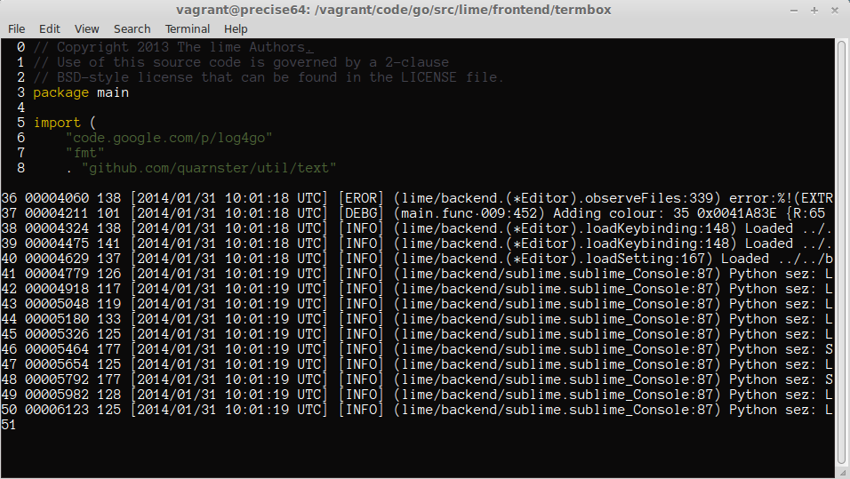

# vagrant-lime

[Vagrantfile][Vagrant] for [limetext/lime][lime]

This was created to isolate [lime's][lime] build process from my normal OS.

[Vagrant]: http://www.vagrantup.com/
[lime]: https://github.com/limetext/lime



## Getting Started
Install [Vagrant][] as instructed by http://www.vagrantup.com/

Clone the repository via `git`

```bash
git clone https://github.com/twolfson/vagrant-lime
```

Launch the Vagrant instance

```bash
vagrant up
# Bringing machine 'default' up with 'virtualbox' provider...
```

When the instance is complete, you will be prompted to run the following commands

```bash
vagrant ssh
cd /vagrant/code/go/src/lime/frontend/termbox
./termbox
```

When the program launches, you should see an image similar to the screenshot at the top of this file.

It will be Ctrl+Q to exit.

> At the time of writing, you must run `termbox` from within `vagrant`. There is no way to run `lime` on the host OS.

> Documentation/Vagrantfile created against https://github.com/limetext/lime/wiki/Building/61390a7

## Contributing
In lieu of a formal styleguide, take care to maintain the existing coding style.

## Donating
Support this project and [others by twolfson][gittip] via [gittip][].

[![Support via Gittip][gittip-badge]][gittip]

[gittip-badge]: https://rawgithub.com/twolfson/gittip-badge/master/dist/gittip.png
[gittip]: https://www.gittip.com/twolfson/

## Unlicense
As of Jan 31 2014, Todd Wolfson has released this repository and its contents to the public domain.

It has been released under the [UNLICENSE][].

[UNLICENSE]: UNLICENSE
